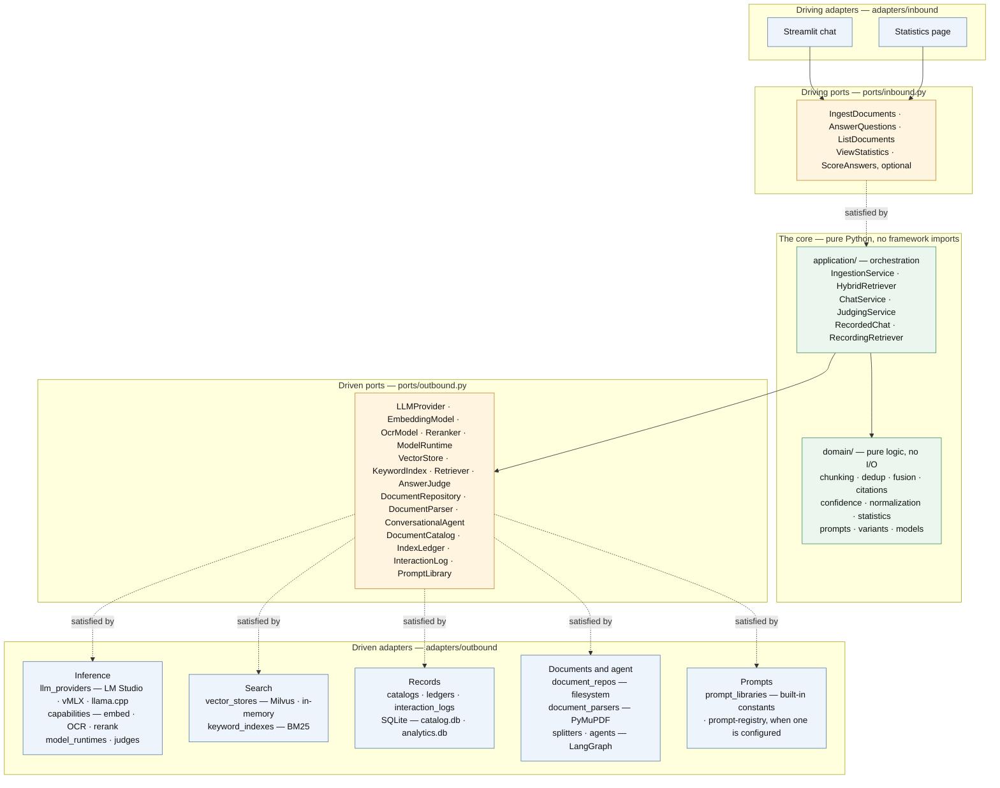
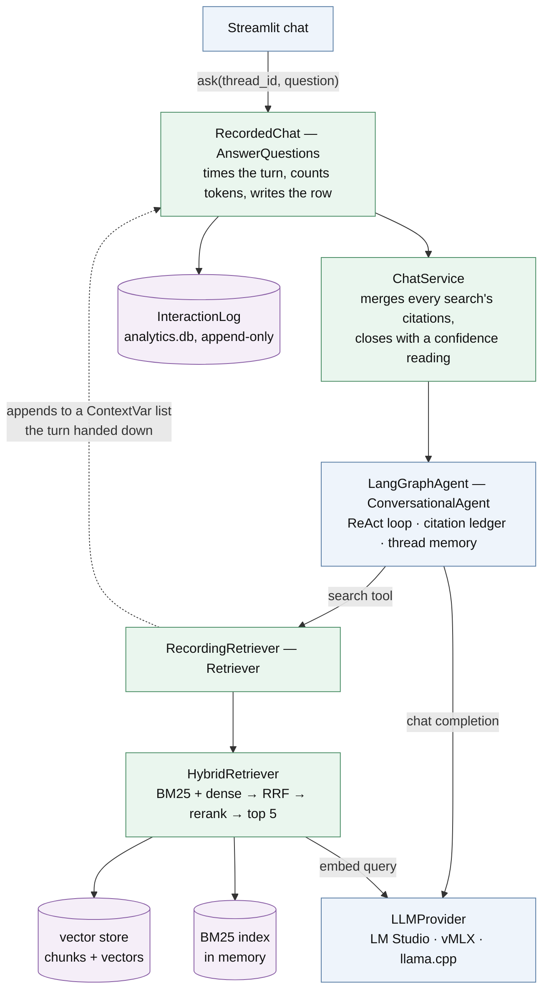

# Document Chatbot

A self-hosted RAG chatbot over your own PDFs. Every model call — chat, embeddings, OCR,
reranking, judging — goes to an inference server you run, on `localhost` by default, so no
document text and no question ever reaches a third party and nothing here needs an API
key. Point `LLM_BASE_URL` at another machine and that stays true of the machine; it is
then your network the text crosses, which is why a server off this box should be started
with `--api-key` and kept on a private one.

Answers are grounded by construction: the model may only answer from numbered passages
that a search returned, every factual claim carries a `[n]` marker, and each marker
hovers to show the passage, page and document it came from. When the corpus does not
cover the question, the model is instructed to say so rather than fill the gap.

Every answered turn is written to an append-only log — the searches it ran, the passages
they returned, which of those the answer cited, the retrieval scores and the tokens — and
a **Statistics** page reads that log back. So retrieval quality is something you can look
at, per document, per search arm and per configuration, instead of something you assume.

---

## Requirements

- **An inference server**, either of:
  - **[LM Studio](https://lmstudio.ai)** — `LLM_BACKEND=lmstudio`, the default — with its
    local server enabled (`http://localhost:1234/v1`) and the `lms` CLI at
    `~/.lmstudio/bin/lms`, which the setup screen uses to download, unload and load models.
  - **[vMLX](https://github.com/jjang-ai/vmlx)** — `LLM_BACKEND=vmlx` — on Apple Silicon,
    started with `vmlx serve <chat-model> --embedding-model <embedder>` and serving
    `http://localhost:8000/v1`. It answers `/v1/rerank`, which LM Studio does not, so it
    is the one backend here that can complete the retrieval pipeline. Models are chosen
    when the server starts rather than from this app, and it holds what that command
    named until it is restarted.
  - **[llama.cpp](https://github.com/ggml-org/llama.cpp)** — `llama-server -hf <repo>
    --rerank --port 1235`, on any platform. This is the engine LM Studio already embeds,
    run as the HTTP server LM Studio does not expose: `/v1/rerank` is a real llama.cpp
    route, reachable from `llama-server` and from nothing on port 1234. One process holds
    one model, so it is normally started for the reranker alone and named as
    `RERANK_BACKEND=llamacpp` beside an LM Studio doing everything else.
- **Python 3.9+** (developed and verified against 3.9.6).
- Roughly **12 GB of RAM** free. The recommended defaults are sized for it: ~5.5 GB chat
  model + ~0.7 GB embedder, leaving room for the KV cache that long RAG prompts need.

## Running it

There are two ways to start this app, and the difference is not the code — it is **who
chooses the models**. Run it locally and you choose, on a setup screen, from what your
server is holding. Deploy it and the environment chose already, because a container has
nobody to click anything.

Everything else is shared: same entrypoint, same `Config`, same stores.

### Locally

```bash
python3 -m venv .venv && source .venv/bin/activate
pip install -r requirements.txt

cp .env.example .env          # optional — every value has a working default
mkdir -p documents            # drop your PDFs here

streamlit run app.py
```

Then, on the setup screen: point it at your server's URL, pick the models, and press
**Load models & documents**. On LM Studio, missing *recommended* models are downloaded for
you (once), anything else in the list is already installed, and models you are not using
are unloaded first so the ingest is not competing for memory with whatever LM Studio was
holding. On vMLX the list is what that server was started with, and none of it moves.

Only `*.pdf` files in `documents/` are read. The folder is never written back to.

### Deployed

```bash
cat > .env <<'EOF'
LLM_BACKEND=vmlx
LLM_BASE_URL=http://ai-01.internal:8000/v1   # or 127.0.0.1 — same thing to the app

CHAT_MODEL=mlx-community/Qwen2.5-VL-7B-Instruct-4bit
OCR_MODEL=mlx-community/Qwen2.5-VL-7B-Instruct-4bit
EMBED_MODEL=mlx-community/embeddinggemma-300m-6bit
RERANKER_MODEL=none
EOF

DOCUMENTS_HOST_DIR=/srv/pdfs docker compose up -d --build
```

Naming `CHAT_MODEL`, `OCR_MODEL` and `EMBED_MODEL` together is the whole switch —
`config.preconfigured()`. The app seeds the setup screen's answers from the environment
and comes up answering. There is no flag, because the three ids *are* the information the
screen was there to collect.

It also **stops managing model residency**: no downloads, no unloading, no waiting for a
load. Whoever runs the inference server owns what is resident on it. That is the right
default for a shared server, and the only safe one for a *remote* LM Studio — `LmsRuntime`
drives the `lms` CLI as a subprocess, so those calls would act on the machine running the
app rather than the machine running the models.

So: make sure the models are loaded before the app starts. On vMLX they are, by
construction — `vmlx serve` binds what it was given.

### Locally, in Docker

Same image, with the source bind-mounted so an edit is a save rather than a rebuild:

```bash
mkdir -p documents            # your PDFs, mounted read-only
docker compose -f docker-compose.yml -f docker-compose.dev.yml up
```

Set no model variables and the container serves **the setup screen**, exactly as
`streamlit run app.py` does — the compose file treats server mode as optional, so one file
covers both jobs. State lands in `./.data/`, where `sqlite3 .data/analytics.db` can reach
it.

The inference server still runs **on the host**, not in a container: `LLM_BASE_URL`
defaults to `http://host.docker.internal:8000/v1`, which is how the container reaches it.
On a Mac that is not a preference — MLX needs the GPU directly and Docker on macOS does
not pass it through, so vMLX can only ever be a host process.

### Which one you are in

| | Locally | Locally, in Docker | Deployed |
|---|---|---|---|
| Models chosen by | you, on the setup screen | you, on the setup screen | `CHAT_MODEL` / `OCR_MODEL` / `EMBED_MODEL` |
| Server address | typed into the screen | `host.docker.internal` | `LLM_BASE_URL` |
| Downloads, load/unload | the app does it | the app does it | the operator does it |
| Documents | `./documents` | `./documents`, read-only | `DOCUMENTS_HOST_DIR`, read-only |
| Stores | beside the source | `./.data/` | the `/data` volume |
| Code changes | immediate | immediate (bind mount) | rebuild the image |

The interactive path is unchanged by any of this: set none of those variables and you get
exactly the setup screen you had before.

`docs/DEPLOY.md` covers the three topologies — app and inference on one box, app in Docker
against vMLX on the host, and inference on its own machine — plus why `EMBED_MODEL` has to
be spelled identically everywhere that shares an index.

### Default model picks

Per backend, because a recommendation is only ever a recommendation *for a server*: LM
Studio runs GGUF through llama.cpp, vMLX runs MLX weights, and neither loads what the
other is pointed at.

**`LLM_BACKEND=lmstudio`**

| Role | Default | Why |
|---|---|---|
| Chat | `qwen/qwen3-vl-8b` | Answers from retrieved passages |
| OCR | same as chat | Reads pages with no text layer — **vision models only** |
| Embeddings | `text-embedding-nomic-embed-text-v1.5` | Largest embedder that actually serves on LM Studio's engines |
| Reranker | *off* | LM Studio serves no `/rerank` route — `RERANK_BACKEND=llamacpp` puts one beside it |
| Judge | *off* | Costs a second model call; opted into, from the Statistics page |

**`LLM_BACKEND=vmlx`**

| Role | Default | Why |
|---|---|---|
| Chat | `mlx-community/Qwen3-VL-8B-Instruct-4bit` | The same model as above, as MLX weights |
| OCR | same as chat | Vision-capable, so the ingest reads scans without a second VLM |
| Embeddings | `mlx-community/embeddinggemma-300m-6bit` | vMLX's own quality pick; its embedding path loads BERT, XLM-RoBERTa and ModernBERT architectures |
| Reranker | `Qwen/Qwen3-Reranker-0.6B` | Loaded on the first `/v1/rerank` call and swapped by name, so it costs nothing until a question is asked |
| Judge | *off* | As above |

**`RERANK_BACKEND=llamacpp`** — the reranker alone, on a second server

| Role | Default | Why |
|---|---|---|
| Reranker | `ggml-org/jina-reranker-v1-turbo-en-GGUF` | 38M parameters, ~75 MB, and what llama.cpp's own tests rerank with, so it loads on whatever build is installed |

No table for the other three roles: one `llama-server` holds one model, fixed at launch,
so a server doing chat is a server that cannot also embed or rerank. Reaching for it as a
whole `LLM_BACKEND` works and means three processes; the reason it is here is the one
route LM Studio cannot serve at all.

```bash
llama-server -hf ggml-org/jina-reranker-v1-turbo-en-GGUF --rerank --port 1235
# then, in .env:
#   RERANK_BACKEND=llamacpp
```

`--rerank` is what mounts the route. Without it the server answers `501 This server does
not support reranking` however good the cross-encoder it loaded — and the app degrades to
RRF order rather than failing, so the flag is worth checking before concluding the model
is bad.

OCR is a separate choice from chat on purpose: a text-only model asked to read a page
image answers about a picture it never saw. It also costs no extra memory in the normal
run — the OCR model is loaded for the ingest and swapped for the chat model when the
ingest ends, so the peak is one vision model either way.

### The reranker is not the embedder

They are two architectures doing two jobs, and neither can stand in for the other:

| | Embedder (bi-encoder) | Reranker (cross-encoder) |
|---|---|---|
| Sees | the query **or** a chunk, separately | the query **and** a chunk, in one pass |
| Produces | a vector | one relevance score |
| Runs over | the whole corpus at ingest, the query at search | the ~50 candidates fusion returned |

Encoding a chunk without ever seeing the question is exactly what makes the embedder
indexable: its vectors are computed once and searched with ANN. The reranker's accuracy
comes from the opposite property — query and chunk attend to each other — so there is
nothing to precompute and nothing to store. An embedding model has no head that emits a
pairwise score, and a reranker emits no vector to put in Milvus.

The same *family* is fine, and often better: shared pretraining keeps the two stages
consistent. The same *checkpoint* is not possible. `HybridRetriever` reflects this — the
reranker only ever re-orders what the two arms already found, and a missing one costs
precision rather than the answer.

## How the RAG works

Two pipelines. **Indexing** runs once per configuration when you press *Load models &
documents*, and turns PDFs into a searchable corpus. **Answering** runs per question, and
turns a question into a cited answer plus a row in the log.

### Indexing

```
documents/*.pdf
     │
     ├──▶ sha256 over the file's bytes — unchanged since the run that indexed it,
     │    under this same variant and the same OCR model?
     │                              └──▶ reuse the stored chunks, next document
     │
     ├──▶ parse pages (PyMuPDF) ──▶ page text under 100 chars?
     │                              └──▶ render at 1.5×, JPEG 85 ──▶ vision-model OCR
     │
     ├──▶ normalize: characters · running heads · page numbers ·
     │               hyphen breaks · wrapped lines · whitespace
     │
     ├──▶ chunk:  fixed | recursive (default) | semantic
     │
     ├──▶ dedup:  L1 document MinHash ≥ 0.85 vs the documents seen so far this run
     │            L2 exact chunk text within this document
     │            L3 cosine ≥ 0.95 vs everything already stored
     │
     └──▶ embed (one request per document) ──▶ vector store
                                              └──▶ BM25 index rebuilt from the whole store
```

**The bytes hash comes first**, and it is what makes an ingest cheap: a document whose file
has not changed is already chunked, embedded and stored, so it is not opened at all — no
parse, no OCR, no embedding call. An ingest that indexes nothing new is the normal case,
and the only reason it still has work to do is the BM25 index, which lives in memory and
has to be rebuilt.

Unchanged bytes are not quite the whole test. A scanned page has no text of its own, so
what is stored for it is *one vision model's account* of the image — another model would
write it differently. The ledger records which model read each document, and a document
read by a model other than the one now configured is read again. One that never needed OCR
is left alone whatever the OCR setting is.

**OCR is per page, not per document**, and triggered by absence: under `MIN_TEXT_LEN`
(100) characters of extracted text means the page carries no usable text layer. It is the
slow path by orders of magnitude — a model call per page against milliseconds for a text
layer — so the UI reports those pages separately as they go.

**Normalization** strips what belongs to the printed page rather than the document.
This is not cosmetic: BM25 tokenises `individ-` and `find` as terms of their own, the
recursive chunker reads a running head as a section heading, and a header repeated on every
page pushes otherwise distinct chunks toward the near-duplicate threshold. Steps are a
chain, and `straighten_quotes` ships available but off — it is the one step that changes
characters a reader would notice.

**Chunking**, three strategies:

| Strategy | How it cuts | Cost |
|---|---|---|
| `fixed` | 500-char windows, 100-char overlap | free |
| `recursive` *(default)* | splits on detected headings first, then LangChain's recursive splitter inside each section — so chunks carry the heading they sit under, and citations can show it | free |
| `semantic` | embeds every sentence, cuts where a 2-sentence window either side drops below 0.75 cosine; anything over 3× `CHUNK_SIZE` falls back to `fixed` | an embedding call per sentence |

**Dedup runs in three layers** because they catch different things, cheapest first: the same
document submitted twice under different filenames (MinHash over the whole text, against the
documents seen so far in this run — a reused document contributes the signature the ledger
kept for it); boilerplate repeated within one document (exact chunk text); and a passage
that already exists somewhere in the corpus (cosine against the store, which includes
documents this run never opened).

**Nothing is ever cleared to make room.** The single exception is a *changed* document's own
chunks, which describe text the file no longer contains — leaving them would mean citing a
version of the page that no longer exists. A document that merely leaves the folder keeps
its chunks and stays citable.

### Answering

```
question
   │
   ├──▶ opening search — run for you, before the model is asked anything
   │
   ├──▶ ReAct loop — the model may search again for a distinct information need
   │
   │      every search:
   │          BM25 top 50    +    dense top 50 (cosine)
   │                 └───────────────┬───────────────┘
   │              RRF: score = Σ 1 / (60 + rank within that arm)
   │                                 │
   │              optional cross-encoder rerank over the fused 50
   │                                 │
   │              final 5 passages, numbered [n] by the thread's ledger
   │
   ├──▶ answer — every factual claim carries [n], or one of the two refusal
   │             sentences when the passages do not cover the question
   │
   ├──▶ shown — uncited passages dropped, markers renumbered from 1,
   │            each one hovering to the passage, page and document behind it
   │
   └──▶ logged — question · answer · every search and its query · every passage
                 with its similarity and arm ranks · which indices were cited ·
                 tokens · latency · the configuration that produced it
                                                             └──▶ analytics.db
```

**The first search is not the model's decision.** Rule 1 of the system prompt tells it to
search before answering anything factual, and a local model does not reliably comply — it
answers from whatever is in front of it. Forcing the call at the provider is not available
either: LM Studio accepts `tool_choice: "required"` and ignores it. So the turn *opens* with
the search already run and written into the thread as an ordinary tool exchange. The tool
stays bound and the loop stays a ReAct loop, so a multi-part question still searches again —
only the first search stopped being optional. If that opening search fails, the turn
degrades to what it would have been without it rather than raising.

**Hybrid retrieval, and how it degrades.** BM25 catches the exact term, the identifier, the
rare proper noun; dense catches the paraphrase. RRF fuses them on rank rather than score,
so neither arm's scale has to be calibrated against the other. Both arms must honour the
same metadata scope, or fusion reintroduces passages the other one excluded. If the dense
arm fails, the search silently continues keyword-only; if the reranker fails, the fused RRF
order stands. A reranker that is down should cost precision, not the answer. And when a
passage is found by both arms, the dense copy is the one kept — it is the one carrying the
similarity score, and keeping the other would log the passage as unmeasured.

Every returned passage records where each arm ranked it (`keyword_rank`, `dense_rank`,
`fused_rank`), so the Statistics page can attribute an answer to the arm that found its
sources — and a search that ran degraded is still attributed instead of logging blanks.

**Numbering is per thread, not per search.** The model sees passages as numbered blocks:

```
[1] Page 3 | An Example Document | 2.1 Method
The first matching passage, which may start or stop mid-sentence...

[2] Page 11 | Another Document Entirely
A passage from a different document.
```

A citation ledger assigns those numbers, and a passage a later search returns again keeps
the number it already had. Numbering that restarted each search would leave one paragraph
holding two different `[1]`s with no way to tell which the answer meant.

**Each turn's retrieval is cleared from the model's view.** Without that, the blocks of
every search a thread ever ran stay in front of the model, and it stops searching — "answer
from the blocks `search_documents` returned" is satisfied by blocks returned three questions
ago. The first document answered from would become the whole corpus. So a `pre_model_hook`
drops earlier turns' tool calls and results, leaving the tool as the only way to reach a
passage. The transcript itself is untouched — questions and answers stay, so a follow-up
still reads as a follow-up — and the turn in flight is left alone, since it is mid-loop over
searches it is about to answer from.

**Refusal is part of the contract.** When the passages do not cover the question the model
is told to write one of two specific sentences: a full refusal, or a partial one that
answers what is supported and names what is missing. Those exact sentences are what the log
matches to tell "declined" apart from "cited nothing and did not say why" — the second is
the failure, and only tracking both makes the first one legible.

**What the reader sees** is not quite what the model wrote. A search casts wide on purpose,
so passages the answer never leaned on are dropped rather than credited, and the survivors
are renumbered from one in order of first mention — otherwise an answer built from the first
and fourth passage shows `[1]` and `[4]` above a list of two, reading as though two sources
had gone missing. Citation-shaped text inside code fences is left exactly as written.

### Confidence, per answer

Every answer closes with a composite confidence score, drawn under the reply and above its
sources. It costs nothing: all three readings come off text and similarity scores that
exist by the time the last token lands, so no second model call stands between the reader
and the number.

| Reading | What it measures | Weight |
|---|---|---|
| Retrieval | How close the best passage the answer cited actually matched, scaled across a cosine band centred on `WEAK_RETRIEVAL` | 0.4 |
| Citation coverage | The share of the answer's claims carrying a marker that resolves to a passage some search returned | 0.4 |
| Completeness | The share of the question's parts the answer visibly addresses — a partial refusal takes one back, since the model itself named an aspect it could not cover | 0.2 |

Each is `None` when nothing measured it — a turn whose passages all came from the keyword
arm has no retrieval reading, since BM25 scores are on an unrelated scale — and the
composite is the weighted mean over whatever *was* measured rather than folding a missing
reading in as zero. The badge always shows the counts behind the number ("2 of 2 claims
cited · 1 of 2 parts answered"), because a weighted mean lets two strong readings carry a
weak one, and the counts are what say which half of the answer to go and check.

Three deliberate choices. **The best cited passage, not the average** — a claim stands on
one passage that says it, so citing a second, weaker one beside it is thoroughness, and an
average would score that answer below the one that cited only the strong passage. **A
marker pointing at a number nothing returned counts against coverage**, because an invented
citation is worse than none. **A full refusal is scored `None`, not zero** — rule 7 asks
for exactly that answer when the passages hold nothing, and grading it on citations it was
told not to make would report the one honest answer in the log as the least trustworthy;
the badge shows the closest passage instead, which is the evidence it was right to decline.

What this is *not* is a claim that the answer is true, or even that each claim follows from
the passage cited under it. That is the judge's question, it needs a second model, and it is
asked later — see below.

### Recording, and scoring

Every answered turn is appended to the interaction log: the question, the answer, each
search and its query, every passage returned with its similarity and arm ranks, which
indices the answer actually cited, the token counts, total latency, time to first token, and
the configuration that produced it all. Time to first token is measured to the first token
*of the answer*, so it includes the searches the model ran before writing anything — which
is the wait a reader actually sits through. All of it together is what makes retrieval
quality measurable after the fact rather than anecdotal.

Judging is separate and opt-in. A second, smaller model reads a recorded answer against the
passages it cited and returns a faithfulness score plus the claims it could not find. It is
asked whether the answer *follows from* the passages — not whether it is true, because a
model asked for both falls back on what it already believes and ends up scoring the corpus
instead of the answer. An answer that correctly declines scores 1.0. It runs from the
Statistics page rather than in the answer path, where a second model call would double what
the reader waits for to produce a number nobody is waiting to read.

### The numbers, in one place

| Constant | Value | Where |
|---|---|---|
| `RETRIEVE_K` / `FINAL_K` | 50 / 5 | `application/constants.py` |
| `RRF_K` | 60 | `domain/constants.py` |
| `CHUNK_SIZE` / `CHUNK_OVERLAP` | 500 / 100 | `domain/constants.py` |
| `MIN_TEXT_LEN` (OCR trigger, min semantic chunk) | 100 | `domain/constants.py` |
| `SEMANTIC_SIMILARITY_THRESHOLD` / `SEMANTIC_WINDOW_SIZE` | 0.75 / 2 | `domain/constants.py` |
| `DEDUP_MINHASH_THRESHOLD` (128 perms) | 0.85 | `domain/constants.py` |
| `DEDUP_COSINE_THRESHOLD` | 0.95 | `domain/constants.py` |
| `RENDER_SCALE` / `JPEG_QUALITY` (OCR raster) | 1.5× / 85 | `adapters/outbound/document_parsers/constants.py` |
| `WEAK_RETRIEVAL` / `FLAT_RETRIEVAL` (flags) | 0.5 / 0.01 | `domain/constants.py` |
| `RETRIEVAL_FLOOR` / `RETRIEVAL_CEILING` (confidence band) | 0.25 / 0.75 | `domain/constants.py` |
| Confidence weights: retrieval / coverage / completeness | 0.4 / 0.4 / 0.2 | `domain/constants.py` |
| `HIGH_CONFIDENCE` / `MEDIUM_CONFIDENCE` (badge bands) | 0.75 / 0.5 | `domain/constants.py` |
| `MIN_CLAIM_WORDS` / `ADDRESSED_OVERLAP` | 4 / 0.5 | `domain/constants.py` |

## Architecture

Hexagonal, and the boundaries are load-bearing rather than decorative: the core has no
framework imports, and swapping a vector database, an inference backend or a UI is a new
adapter plus one line in a registry.



The core depends only on ports it defines itself — nothing in `domain/` or `application/`
imports an adapter, and the two registries are the only modules that name a concrete
backend. The ports are structural `Protocol`s, so an adapter satisfies one by shape and
never imports the port module to implement it — which is why the dotted edges read
*satisfied by* rather than *inherits*. [composition.py](composition.py) is the only module
that names both sides.

```
app.py            Entrypoint — `streamlit run app.py`
composition.py    The single place ports meet adapters. Documents where all state lives.
constants.py      Defaults, recommended models, registered backends
config.py         The env-backed `Config` built over them

ports/            Protocols only
  inbound.py      Use cases a UI may invoke
  outbound.py     What the core needs from the world

domain/           Pure logic, no I/O: chunking, dedup, fusion, citations,
                  confidence, normalization, statistics, index variants
                  — every value they read is in `domain/constants.py`
application/      Orchestration: ingest, retrieval, chat, judging, analytics
adapters/
  inbound/        Streamlit chat + statistics pages
  outbound/       One package per port, named for what it implements — so a
                  directory listing answers "what can back this?"
    llm_providers/     LM Studio · vMLX · llama.cpp, and the registry that picks
    model_runtimes/    each backend's other half: what is installed, and loading it
    capabilities/      embeddings · OCR · rerank, each bound to one provider
    vector_stores/     Milvus · in-memory, and the registry that picks
    keyword_indexes/   BM25            agents/            LangGraph
    document_parsers/  PyMuPDF         document_repos/    filesystem
    judges/            answer scoring  splitters/         recursive split
    prompt_libraries/  the built-in prompts, or a prompt-registry
    catalogs/  ledgers/  interaction_logs/     SQLite, one file each
```

Read [composition.py](composition.py) first — its module docstring is the
map of what is stored where and what survives a restart.

### How one question is wired

The object graph a question actually travels, as `composition.py` builds it. Two of these
are decorators the layer beneath is unaware of: `RecordedChat` wraps the chat service so an
answer survives a log that fails, and `RecordingRetriever` wraps the retriever *before* the
agent ever sees it, so a search the model runs anywhere inside the ReAct loop is on the
record.



The dotted edge is the one piece of the picture that is not a call. A search happens several
layers below the call that will write the row — and LangGraph runs the search tool on a
worker thread when the model asks for two searches at once — so the turn hands a mutable
list *down* through a `ContextVar` rather than collecting results on the way back up. The
reasoning, including the three plausible mechanisms that do not work here, is in
[application/analytics.py](application/analytics.py).

## Configuration

Model and chunking choices are made on the setup screen — *unless* the environment makes
them, which is what deploying means. Set none of the model variables below and the screen
decides, as it always has; set the three required ones and it is skipped entirely. See
[Running it](#running-it).

| Variable | Default | Meaning |
|---|---|---|
| `LLM_BACKEND` | `lmstudio` | Which server answers — see `available_backends()`; decides the model lists, the recommendations and the default URL |
| `LLM_BASE_URL` | the backend's own | Where that server is. The one setting that moves inference to another machine — and loopback is not a special case |
| `CHAT_MODEL` | recommended | Skips the setup screen when set together with the two below |
| `OCR_MODEL` | recommended | Must be vision-capable |
| `EMBED_MODEL` | recommended | **Names the vector collection** — spell it identically everywhere that shares an index |
| `RERANKER_MODEL` | recommended | `none` to decline one the backend recommends |
| `JUDGE_MODEL` | *unset* | `none` is the same as unset here; scoring is opt-in |
| `CHUNKING_STRATEGY` | `recursive` | `fixed`, `recursive` or `semantic` |
| `DOCUMENTS_DIR` | `./documents` | Where the PDFs are read from; a mounted volume when deployed |
| `RERANK_BACKEND` | *unset* | Rerank on a different backend from everything else |
| `RERANK_BASE_URL` | *unset* | Rerank on a different server; either of these two alone is enough |
| `VMLX_API_KEY` | *unset* | Bearer token, for a vMLX started with `--api-key` |
| `LLAMA_API_KEY` | *unset* | Bearer token, for a `llama-server` started with `--api-key` |
| `VECTOR_BACKEND` | `milvus` | `milvus` or `memory` (no deps, no persistence) |
| `VECTOR_URI` | `chatbot.db` | milvus-lite file path, or `http://host:19530` |
| `VECTOR_COLLECTION` | `documents` | Base name; each variant qualifies it |
| `CATALOG_URI` | `catalog.db` | Document catalog + index ledger |
| `ANALYTICS_URI` | `analytics.db` | Interaction log (WAL mode, two sidecar files) |
| `PROMPT_REGISTRY_URL` | *unset* | Read the prompts from a `prompt-registry` instead of `domain/constants.py` |
| `PROMPT_REGISTRY_TOKEN` | *unset* | Bearer token, if the registry is behind something that authenticates |
| `PROMPT_REGISTRY_TTL_SECONDS` | `300` | How long a resolved prompt is reused — the lag between publishing one and using it |

### Prompts, and where they come from

The prompts are constants in [`domain/constants.py`](domain/constants.py) — the system
prompt with its ten citation rules, the search tool's description, the OCR instruction,
and the two the judge uses. That is the default and it needs nothing running: the app
answers on the prompts it ships with.

Set `PROMPT_REGISTRY_URL` and those five are read from a
[`prompt-registry`](../prompt-registry) instead, by key:

| Key | Stands in for |
|---|---|
| `chatbot.system` | `SYSTEM_PROMPT` |
| `chatbot.search-tool` | `SEARCH_TOOL_DESCRIPTION` |
| `chatbot.ocr-instruction` | `OCR_INSTRUCTION` |
| `chatbot.judge` | `JUDGE_PROMPT` |
| `chatbot.judge-request` | `JUDGE_REQUEST` |

The registry stores a key, a value, a version number and which version is live — and
nothing about how the value is used. Which model a prompt goes to, at what temperature,
with how many tokens, is still decided here, by the same `Config` as before. So this is
a prompt *store*, not a second place the app is configured.

What the indirection buys is that a prompt can be edited and published in the registry's
console and picked up by a running app, without a restart and without a deploy —
`PROMPT_REGISTRY_TTL_SECONDS` is how long that takes. The graph is rebuilt when the
system prompt or the tool description changes, and open conversations survive it: the
checkpointer and the citation ledgers outlive the rebuild, so a thread keeps its history
and its passage numbering.

Three properties worth relying on:

- **A failure is the built-in prompt.** The registry down, a key never published, a body
  that came back malformed — all of them resolve to the constant, per key and per lookup.
  Nothing about answering a question depends on a prompt store being up.
- **Per key, not all-or-nothing.** Publishing `chatbot.system` and leaving the other four
  alone is a valid way to run this. The rest stay as they ship.
- **A hit is a dict lookup.** Bodies are cached for the TTL, so the number of HTTP calls
  is bounded by the number of keys, not by the number of questions.

**One rule for a registered system prompt.** Write the two refusal sentences as
`{{refusal_sentence}}` and `{{partial_refusal_sentence}}` rather than spelling them out.
`domain.citations.refusal_kind` recognises a refusal by matching those exact sentences,
so a reworded copy would still produce refusals and this app would read every one of them
as an ordinary answer that happened to cite nothing — and it would fail silently. The
adapter substitutes both placeholders from `domain/constants.py`, which is what keeps the
two ends tied together through the registry.

The client the app talks to the registry with is
[vendored](adapters/outbound/prompt_libraries/client.py) — single file, stdlib only,
copied from the registry, which is written to be vendored exactly that way. There is no
`prompt-registry` dependency in `requirements.txt`, and a registry that is not running
costs an import of nothing.

### Index variants — why switching models is cheap

An index is *named* by the embedding model and chunking strategy that filled it, not
merely qualified by them: a vector only compares to vectors from the same embedder, and
pages cut by one strategy are a different corpus from the same pages cut by another. So
each pair gets its own collection and its own ledger, side by side in the same database.
Nothing is ever cleared to make room, and returning to a combination you used before is a
lookup rather than a re-ingest.

### State, and what survives what

| Store | Lives in | Survives restart |
|---|---|---|
| Chunks + vectors + metadata | vector store, per variant | yes (`milvus`) |
| BM25 keyword index | memory | no — rebuilt each ingest |
| Index ledger (bytes hash, OCR model, MinHash) | `catalog.db` | yes |
| Document catalog (title per document ever seen) | `catalog.db` | yes |
| Chat threads | LangGraph `InMemorySaver` | no |
| Interaction log | `analytics.db` | yes, append-only |

Two of these outlive the index deliberately. The catalog keeps the title a document's
already-written citations were shown under, even after the file leaves the folder; the log
is history, and deleting it loses the history and nothing else. All `*.db*` files are
gitignored, as are the PDFs in `documents/`.

## Statistics page

Computed in Python over a window of recent turns (SQLite has no median and no
percentile), and every ratio reads 0.0 on an empty log — a first run is not an error.

- **Confidence** — retrieval similarity, with flags for *weak* (top match below 0.5
  cosine: nothing really matched) and *flat* retrieval (top-to-rest gap below 0.01: the
  order the model read was close to arbitrary). The flat threshold is calibrated against
  this corpus, so treat a flag as a prompt to look, not a verdict.
- **What the answers did** — grounded, refused, partially refused; latency median and p95.
- **Retrieval by document**, **what the model searched for**, and **which arm found it**
  (keyword / dense / both / unattributed).
- **By configuration** — the same questions, sliced by the models and strategy that
  answered them.
- **Judging** — score unjudged turns in batches, and see the claims a judge could not find
  in the cited passages. Unjudged turns are shown as unjudged rather than as passing.

## Extending it

- **Vector backend** — implement `ports.outbound.VectorStore`, register a builder in
  [adapters/outbound/vector_stores/registry.py](adapters/outbound/vector_stores/registry.py).
  Honour the contract in the port's docstring: cosine similarity where larger is closer,
  `Passage.score` always set, and `where` scoping that agrees with
  `MetadataFilter.matches`.
- **Inference backend** — implement `ports.outbound.LLMProvider` and
  `ports.outbound.ModelRuntime`, then register both in
  [adapters/outbound/llm_providers/registry.py](adapters/outbound/llm_providers/registry.py) and describe the
  server in `constants.BACKENDS`. All four capabilities (chat, OCR, embeddings, rerank)
  follow from the provider, since each capability adapter holds one rather than a
  connection of its own. [adapters/outbound/llm_providers/vmlx.py](adapters/outbound/llm_providers/vmlx.py) is the
  worked example; [adapters/outbound/llm_providers/llama_cpp.py](adapters/outbound/llm_providers/llama_cpp.py) is the
  narrow one — a backend registered for a single capability and reached through
  `RERANK_BACKEND`, which is all a backend has to answer for to be worth having.
- **Chunking strategy** — add it in `domain.chunking` and to `STRATEGIES` in
  `adapters.inbound.constants`. It
  names a new collection automatically, so it cannot collide with an existing index.
- **Text normalization** — pass a different sequence to `build_normalizer`
  (`DEFAULT_STEPS + (straighten_quotes,)`) in `composition.build`.

## Note on `agent.py` and `document.py`

These are the pre-rewrite monolith, kept for reference. Nothing in the running app imports
them — the entrypoint is `app.py` → `adapters/inbound/streamlit_ui.py`. The hexagonal
version is the one to read and change.
